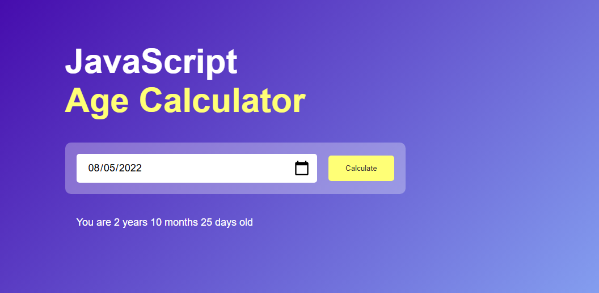

# 📆 Age Calculator App

The Age Calculator is a simple web app that calculates a person's age in **years, months, and days** based on their date of birth. It's built with **HTML, CSS, and JavaScript** and is perfect for beginner practice or use in small projects.

---

## 🧮 Features

- Select your birthdate using a date picker
- Calculates your exact age (e.g. `24 years 3 months 12 days old`)
- Prevents selecting future dates
- Clean and responsive user interface
- Styled output below the input

---

## 🚀 Demo

---

## 📂 Project Structure

